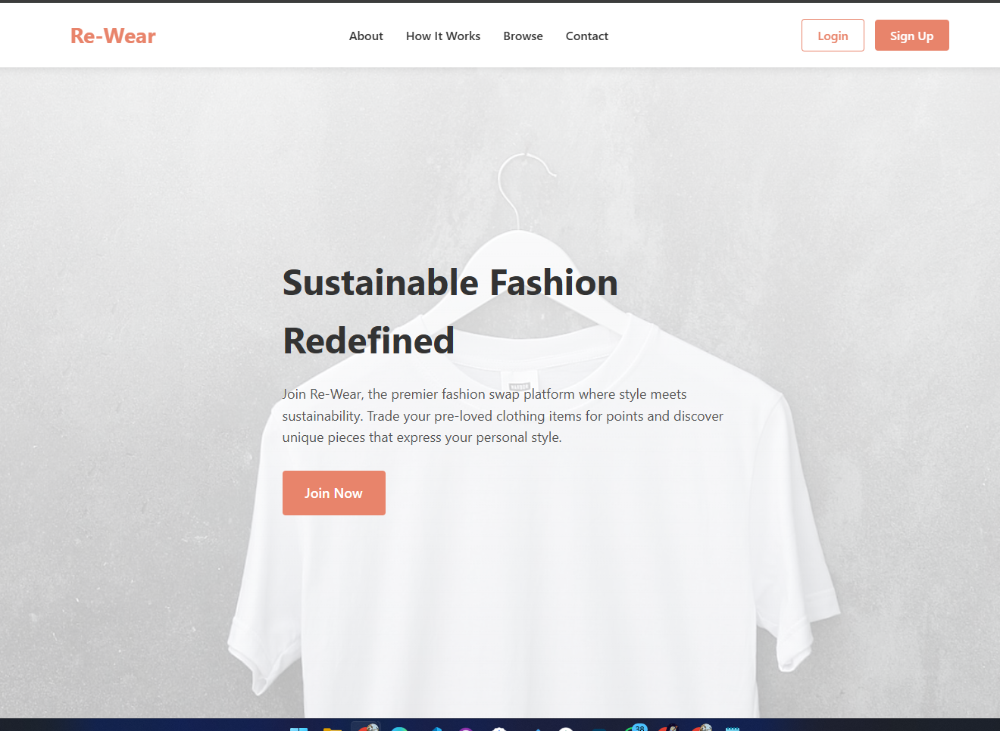
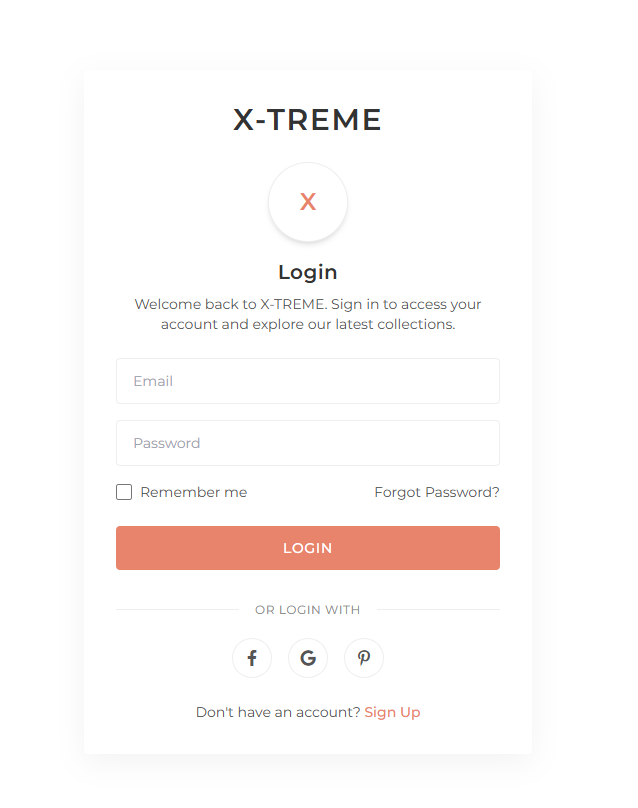
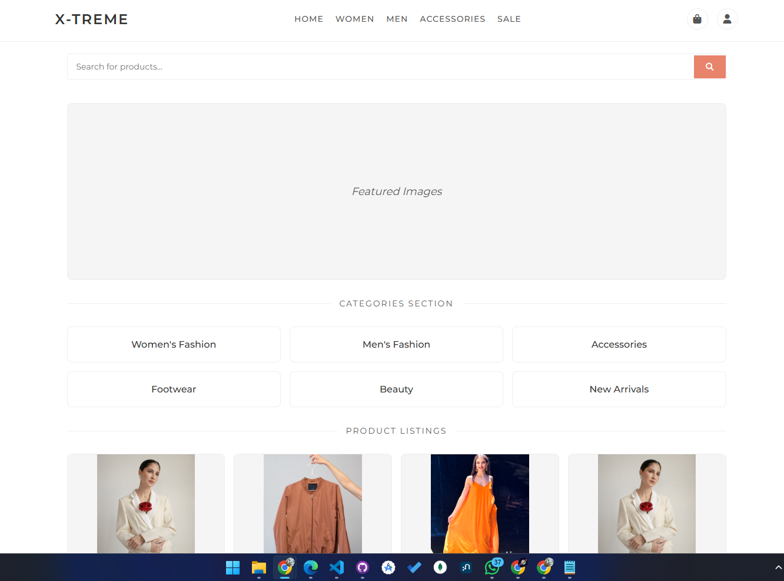
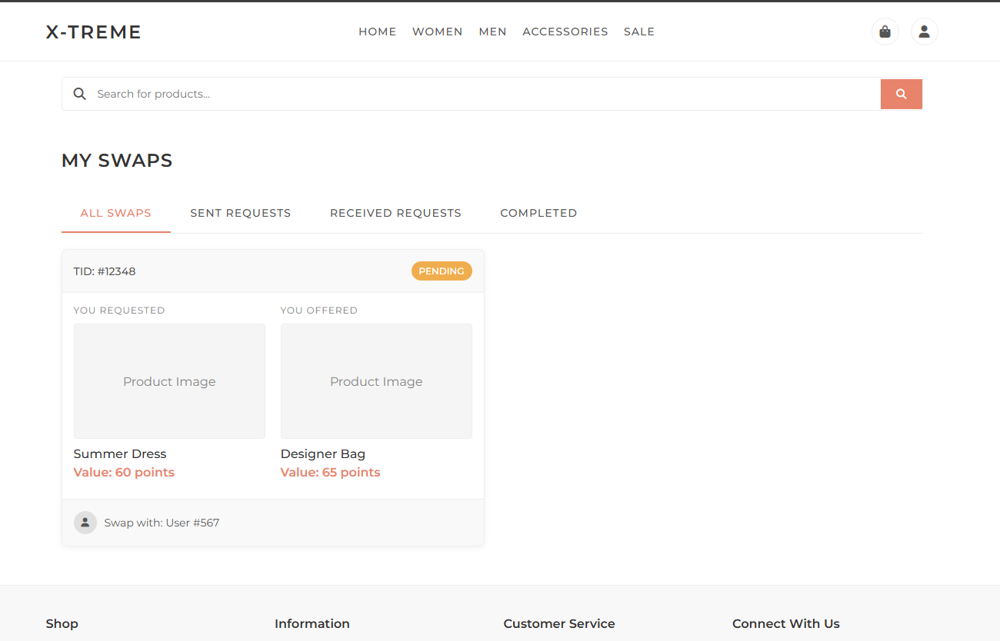
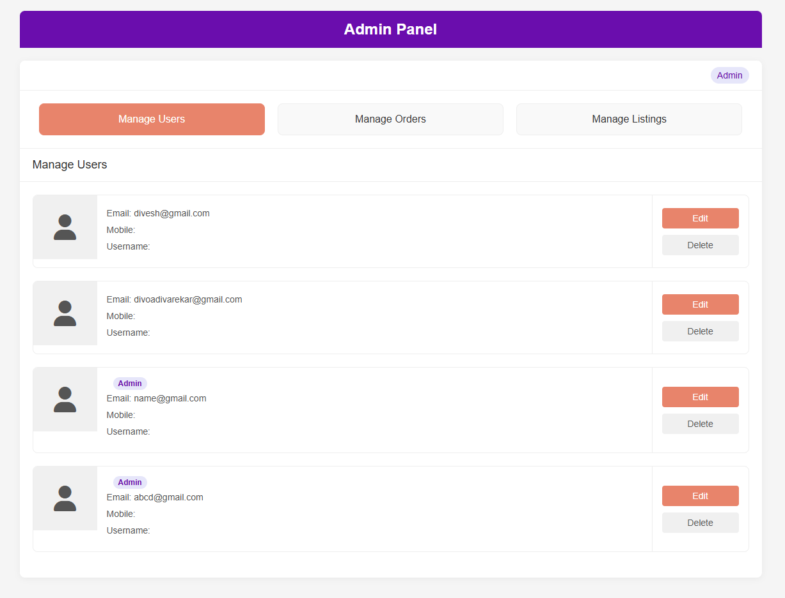
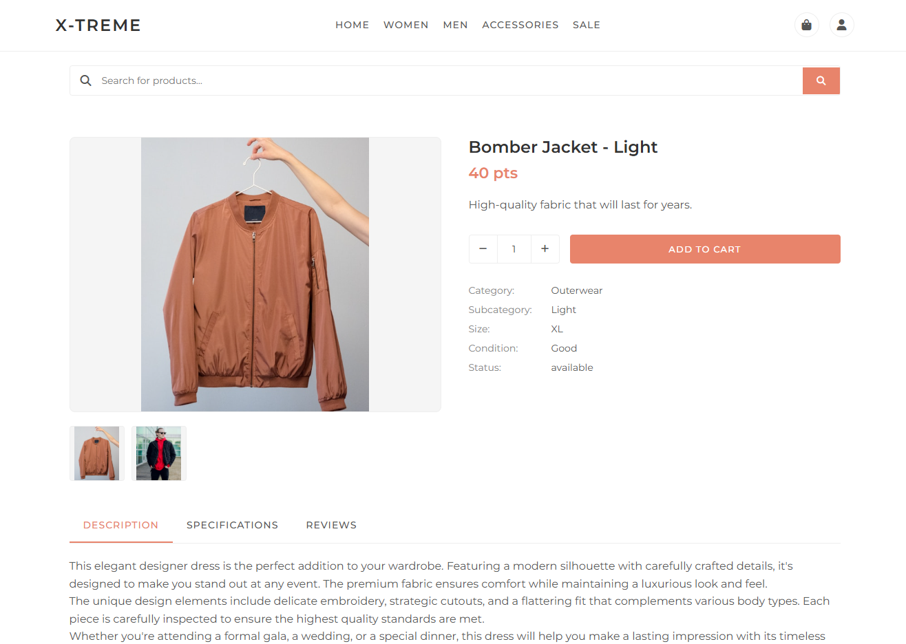
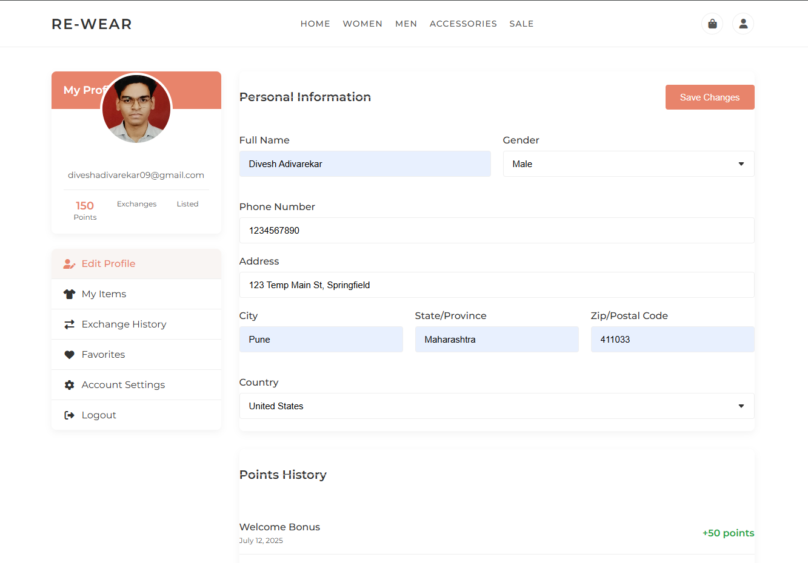
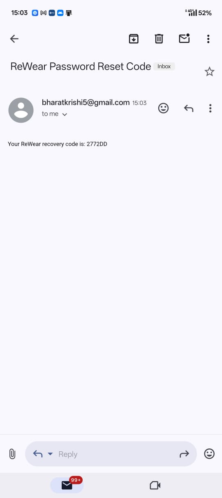

# 👚 ReWear: A Sustainable Clothing Swap Platform

ReWear is a web-based platform designed to promote **sustainable fashion** by allowing users to **swap clothing** instead of throwing it away. By using a **points-based system**, users are rewarded for every item they give away, encouraging active participation and reducing textile waste.

---

## 🖼️ Screenshots

### Landing Page



### Login Page



### User Dashboard



### order Management



### Admin Panel



### Product Page



### Profile Page



### Password reset



---

## 🌿 Features

- 🔁 **Points-based swapping system**
  - Users earn points by offering clothes
  - Points can be spent to request other listed items

- 👤 **User Registration & Profiles**
  - Sign up, log in, and manage personal listings
  - Upload images and item details with ease

- 📦 **Swap Dashboard**
  - Track all swap transactions: sent, received, and completed
  - View transaction statuses (pending, completed, rejected)

- 🔐 **Secure Authentication**
  - Passwords are hashed with **Bcrypt**
  - **Forgot Password** support via recovery code and email

- 🛡️ **Role-Based Access**
  - **Admins** can manage users, products, and swaps
  - Access control via decorators (`@login_required`, `@admin_required`)

- 📨 **Email Integration**
  - Password reset through **SMTP-based email system**

- 💬 **Flash Messaging**
  - Get real-time feedback (e.g., swap confirmation, errors)

- 🌱 **Eco-Friendly Mission**
  - Helps reduce clothing waste and promotes circular fashion economy

---

## 🛠️ Tech Stack

| Layer        | Technology                     |
|--------------|-------------------------------|
| **Frontend** | HTML, CSS, JavaScript, FontAwesome |
| **Backend**  | Flask (Python)                |
| **Database** | SQLite + SQLAlchemy ORM       |
| **Security** | Flask-Bcrypt                  |
| **Email**    | Flask-Mail (SMTP)             |

---

## 🔧 Setup Instructions

1. **Clone the repository**:
   ```bash
   git clone https://github.com/atharva-karanjawane/team_3482_odoo_hackathon_25.git
   cd team_3482_odoo_hackathon_25
    ```

2. **Install dependencies**:

   ```bash
   pip install -r requirements.txt
   ```

3. **Set environment variables** (example for development):

   ```bash
   export FLASK_APP=app.py
   export FLASK_ENV=development
   ```

4. **Run the app**:

   ```bash
   python ReWear/app.py
   ```

5. **Open in browser**:
   Navigate to `http://127.0.0.1:5000`

---

## 🔐 Admin Access

* Admin users have enhanced control:

  * View and manage all users
  * View and manage listings and transactions
* Role is defined in the database (`user.role = "admin"`)

---

## 📂 Project Structure (Simplified)

```
ReWear/
│
├── templates/            # HTML templates
│
├── database.py           # SQLAlchemy Models
├── app.py                # Main Flask app
├── requirements.txt      # Dependencies
└── README.md             # You're here
```

---

## 💚 Sustainability Impact

Every successful swap on ReWear:

* 🌍 Reduces landfill waste
* 💧 Saves water and energy used in garment production
* 🧥 Gives clothes a longer life

By participating in ReWear, you're not just trading clothes—you're building a more sustainable world.

---

## 🤝 Contributing

We welcome pull requests and suggestions! Please fork the repo and open a PR or raise an issue to discuss your idea.

---

## 📜 License

This project is licensed under the MIT License. See [`LICENSE`](LICENSE) for more information.

---

## ✨ Acknowledgments

* Inspired by the principles of **circular fashion**
* Developed as a hackathon project with a mission to **make fashion fun, fair, and eco-friendly**

---

## 🙌 Join the Movement

**Clean your closet. Earn points. Swap sustainably.
ReWear — Where Fashion Meets Purpose.**
